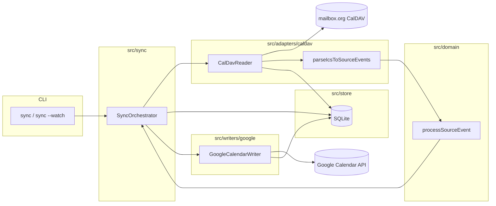

# Phase 3: CalDAV read, UID store, and Google sync loop - Research

**Researched:** 2026-09-15
**Domain:** CalDAV incremental read (mailbox.org), SQLite idempotency store, Google Calendar API writer, sync orchestration
**Confidence:** MEDIUM (Google/SQLite/tsdav APIs HIGH; mailbox.org delta semantics MEDIUM until live spike)

<user_constraints>
## User Constraints (from CONTEXT.md)

### Locked Decisions

#### CalDAV read & deltas
- **D-01:** **Single configured source calendar** per instance (URL/ID in config) — not multi-calendar merge; aligns with one-person-per-container model.
- **D-02:** Prefer **sync-collection / sync-token deltas** on each cycle; **spike mailbox.org semantics early** (STATE concern). Fall back to alternate delta strategy only if spike fails — record outcome in research/plan.
- **D-03:** Pilot credentials via **environment variables validated with Zod** (CalDAV URL, username, app-specific password). Docker secrets abstraction deferred to Phase 5.
- **D-04:** Source **removals** propagate to Google as **cancelled events**, not hard delete — reduces risk of data loss from bridge bugs while satisfying SYNC-12 intent (no stale *active* copies). **Planner/verifier:** treat SYNC-12 as “deletion on source removes user-visible event on target (cancelled OK)” unless REQUIREMENTS text is updated in it-strategy.
- **D-05:** Surface deletions to the loop via **sync-collection removed UIDs** when available; if spike shows gaps, implementer may add snapshot diff as fallback (must still honor D-04).

#### UID store & idempotency
- **D-06:** SQLite primary mapping key is **`source uid` + optional `recurrenceId`** (composite) — separate rows for recurrence exceptions; prevents duplicate Google instances on restart (SYNC-11).
- **D-07:** Add **`bridge_uuid`** column generated on first sync — stable bridge-side identifier for possible future bi-directional work; not used for day-to-day one-way logic beyond create/link metadata.
- **D-08:** Persist database at **configurable path** (e.g. `DATA_DIR` / `SQLITE_PATH`) with sensible local default; Docker volume in Phase 5.
- **D-09:** On drop/sensitive or source cancel: **keep SQLite row**, mark **cancelled** state, cancel on Google (D-04); do not delete mapping row by default.
- **D-10:** Day-to-day **tier changes** (public ↔ busy ↔ drop): **update the same mapped Google event in place** — no bulk migration tooling in Phase 3.

#### Google writer & recurrence
- **D-11:** **OAuth2 refresh token** + client id/secret via env (Zod); **calendar scope only** (SEC-01).
- **D-12:** Target **`GOOGLE_CALENDAR_ID`** in config — explicit pilot calendar, not implicit primary.
- **D-13:** Recurrence: **Google recurring master + instance API pattern** for modified/deleted exceptions (SYNC-07); align with Phase 1/2 recurrence fixtures.
- **D-14:** On create: **`iCalUID` = source UID**; persist **`bridge_uuid` in private extended property** (and SQLite). Source UID remains canonical for one-way idempotency.
- **D-15:** Busy-blocks on Google: summary **"Busy"**, **opaque** transparency, strip PII fields per Phase 2 washing.

#### Sync loop & pilot run
- **D-16:** **Configurable `SYNC_INTERVAL_SECONDS`**, default **~5 minutes** — meets SYNC-06 “within minutes”.
- **D-17:** CLI entrypoint: **`sync` (one shot)** and **`sync --watch`** loop from `src/index.ts` stub.
- **D-18:** Per-event Google write failures: **log, skip, continue**; retry on next poll — do not fail entire cycle.
- **D-19:** **Mocked acceptance tests** in CI (fixture CalDAV + mocked Google client); no live provider credentials in CI (Phase 1 D-13/D-14).
- **D-20:** **SYNC-13:** No extra client-side far-future filter in Phase 3 — sync what CalDAV returns; **document mailbox.org ~1-year limit** in ops notes.

### Claude's Discretion
- Exact Zod env schema names and extended-property key string for `bridge_uuid`.
- sync-collection fallback strategy if mailbox.org spike fails (ETag poll vs snapshot diff) while preserving D-04/D-05.
- SQLite schema details beyond keys (columns for `google_event_id`, `status`, `last_synced_at`, etc.).
- Google client library wiring (`googleapis`) and writer interface shape matching ARCHITECTURE.md `CalendarWriter`.

### Deferred Ideas (OUT OF SCOPE)
- **Bulk classification migration** (mass tier changes) — operational tool, not Phase 3.
- **Bi-directional sync** — out of scope per PROJECT.md; `bridge_uuid` is forward-looking metadata only.
- **Withhold notifications & IT audit** — Phase 4.
- **Docker secrets / Compose pilot packaging** — Phase 5.
</user_constraints>

<phase_requirements>
## Phase Requirements

| ID | Description | Research Support |
|----|-------------|------------------|
| SYNC-01 | One-way sync mailbox.org → Google | CalDAV read adapter + Google writer + orchestrator; no write to source (SEC-01) |
| SYNC-05 | Withhold ER-SENSITIVE (no busy-block) | Existing `processSourceEvent` → `drop`; writer cancels mapped Google event if tier becomes drop |
| SYNC-06 | Create/update/delete within minutes | `SYNC_INTERVAL_SECONDS` + delta read; per-event error isolation (D-18) |
| SYNC-07 | Recurring events + modified/deleted instances | `parseIcsToSourceEvents` + composite SQLite keys + Google master/instance/cancelled-exception pattern |
| SYNC-11 | Idempotent sync — no duplicates on restart | SQLite upsert on `(uid, recurrenceId)` + Google `iCalUID` on create |
| SYNC-12 | Source deletions → no stale active copies | CalDAV deleted UIDs + Google `status: cancelled` (D-04), not hard delete |
| SYNC-13 | ~1-year CalDAV horizon | Document in README/ops; no client-side filter (D-20) |
| SEC-01 | Read-only mailbox.org | CalDAV adapter: GET/REPORT/PROPFIND only; never tsdav create/update/delete calendar objects |
| SEC-03 | Google OAuth calendar scope only | `google-auth-library` with `https://www.googleapis.com/auth/calendar` (or narrower `calendar.events`) |
| SEC-04 | Per-member credential isolation | Single-account env schema per process; no multi-tenant secret blob |
| OPS-01 | Single-account pilot configuration | Zod-validated env: one CalDAV calendar URL + one `GOOGLE_CALENDAR_ID` |
| OPS-03 | Operator sync status / last success | Structured logging (pino) + persisted `sync_state.last_success_at` in SQLite; withhold UI deferred Phase 4 |
</phase_requirements>

## Summary

Phase 3 wires the first end-to-end path: incremental CalDAV read → existing classify/wash pipeline → SQLite-backed Google upserts/cancels → periodic CLI loop. The codebase already has pure domain logic (`processSourceEvent`, recurrence-aware `parseIcsToSourceEvents`); placeholders exist under `src/sync/` only.

The highest uncertainty is **mailbox.org delta semantics**. Community reports and client behavior (DAVx⁵, Planify) suggest many German-hosted CalDAV servers return **HTTP 403** on `DAV:sync-collection`, forcing **calendar-query + CTag/basic diff** instead of RFC 6578 tokens. [CITED: github.com/alainm23/planify/pull/2368] [CITED: manual.davx5.com/technical_information.html] tsdav already implements both paths via `smartCollectionSync` (`webdav` vs `basic`) and exposes deleted object URLs as **404 entries** in the webdav path. [CITED: github.com/natelindev/tsdav/blob/main/src/collection.ts] A **live spike against the operator’s calendar URL** must be Plan Wave 0 — outcome drives whether the bridge stores `sync_token` or relies on snapshot/CTag diff for tombstones (D-05).

Google recurrence should follow official guidance: recurring **master** for the series, **PUT/PATCH on instance IDs** for exceptions, **`status: cancelled`** on instance resources for deleted occurrences (matches Phase 1 `deleted-instance` EXDATE fixture semantics at the Google layer). [CITED: developers.google.com/calendar/api/guides/recurringevents]

**Primary recommendation:** Implement thin ports (`CalDavReader`, `EventMappingStore`, `CalendarWriter`) first; spike mailbox.org; default CalDAV client to tsdav `DAVClient` + `syncCalendars`/`smartCollectionSync` with explicit fallback; persist composite keys in better-sqlite3; mock both ports in CI acceptance tests.

## Architectural Responsibility Map

| Capability | Primary Tier | Secondary Tier | Rationale |
|------------|-------------|----------------|-----------|
| CalDAV delta fetch | API / Backend (adapter) | — | Server-side REPORT/PROPFIND; credentials stay in process env |
| iCal parse → `SourceEvent[]` | API / Backend (adapter) | Domain types | Already in `src/adapters/ical/`; domain stays pure |
| Classify / wash | Domain | — | No I/O; unchanged from Phase 2 |
| UID ↔ Google ID map | Database / Storage | API orchestration | SQLite per container; survives restarts |
| Google create/update/cancel | API / Backend (writer) | — | OAuth + Calendar API v3 |
| Sync scheduling / CLI | API / Backend | — | Node process loop; not browser |
| Operator status (OPS-03 partial) | API / Backend | — | Logs + SQLite metadata; no UI in Phase 3 |

## Project Constraints (from CLAUDE.md)

No `CLAUDE.md` present in repository root — follow `.planning/PROJECT.md`, Phase 3 `03-CONTEXT.md`, and hybrid layout from Phase 1 (`src/domain/`, `src/adapters/`, `src/sync/`).

## mailbox.org sync-collection — spike findings & recommendations

> **Status:** Pre-implementation research synthesis. Live spike not run in this session — treat provider-specific rows as **MEDIUM** until operator credentials exercise Wave 0.

### What to verify in Wave 0 spike (15–30 min)

1. **Calendar URL** — Use per-calendar URL `https://dav.mailbox.org/caldav/<calendar-id>` from mailbox.org calendar properties, not only server root. [CITED: userforum-en.mailbox.org/topic/2526]
2. **PROPFIND** `DAV:supported-report-set` on the calendar collection — does it list `sync-collection`? (RFC 6578 requires advertising support.) [CITED: rfc-editor.org/info/rfc6578]
3. **REPORT sync-collection** with stored token — HTTP 200 + new `sync-token` + 404 tombstones vs **403/501** failure.
4. **Fallback:** `REPORT calendar-query` with `getetag` + `calendar-data`, Depth 1 (forum curl example). [CITED: userforum-en.mailbox.org/topic/2526]
5. **Record:** token persistence, deleted UID discovery, payload size at ~1y horizon (SYNC-13).

### Ecosystem evidence (not mailbox.org official)

| Observation | Source | Confidence |
|-------------|--------|--------------|
| Posteo, **Mailbox.org**, Horde, KolabNow may return **403** on `sync-collection`; clients fall back to full fetch | Planify merged PR #2368 | MEDIUM |
| DAVx⁵ uses Collection Sync when supported, else `calendar-query` | DAVx⁵ manual §7 | HIGH (client doc) |
| Deleted resources in sync-collection appear as **404** on member hrefs | RFC 6578 + tsdav parser | HIGH |

### tsdav behavior (use this, do not hand-roll REPORT XML)

- **`smartCollectionSync`** chooses `webdav` when `collection.reports` includes `syncCollection`, else **`basic`** (CTag/compare local vs remote object lists). [CITED: github.com/natelindev/tsdav/blob/main/src/collection.ts]
- **WebDAV path:** `syncCollection` → multiget changed hrefs → classifies **404 hrefs as `deleted`**. [CITED: github.com/natelindev/tsdav/blob/main/src/collection.ts]
- **High-level API:** `DAVClient.syncCalendars()` / `syncCalendarsDetailed()` wrap calendar-level sync (see `src/calendar.ts`). [CITED: github.com/natelindev/tsdav/blob/main/src/calendar.ts]
- **Auth for mailbox.org:** `authMethod: 'Basic'` with username + app-specific password; `serverUrl` typically `https://dav.mailbox.org`. [CITED: github.com/natelindev/tsdav/blob/main/README.md]

### Recommended bridge strategy (honors D-02, D-04, D-05)

```text
1. PROPFIND supported-report-set + optional trial sync-collection
2. If sync-collection works → persist sync_token in SQLite sync_state; consume tsdav deleted[] + changed ICS
3. If 403/unsupported → force smartCollectionSync method: 'basic' OR custom snapshot:
   - fetch all object hrefs + etags (calendar-query)
   - diff against previous snapshot in SQLite (href/uid set)
   - deletions = uids present last cycle but absent now (D-05 fallback)
4. Map deleted ICS hrefs → source UID via last-known mapping table (do not rely on CalDAV returning UID for tombstones)
```

**Planner note:** Snapshot fallback is acceptable for pilot scale (one calendar, ~1y window); log when fallback active for OPS-03.

## Standard Stack

### Core

| Library | Version (npm view 2026-09-15) | Purpose | Why Standard |
|---------|----------------------------------|---------|--------------|
| `tsdav` | 2.3.3 [VERIFIED: npm registry] | CalDAV read, sync-collection/basic sync | Native TS; Basic auth; `smartCollectionSync` [CITED: github.com/natelindev/tsdav] |
| `googleapis` | 181.0.0 [VERIFIED: npm registry] | Calendar API v3 | Official Google client [CITED: developers.google.com/calendar/api/v3/reference] |
| `google-auth-library` | 11.0.2 [VERIFIED: npm registry] | OAuth2 refresh from env | Used by googleapis; scope control (SEC-03) |
| `better-sqlite3` | 13.0.3 [VERIFIED: npm registry] | UID map + sync metadata | Atomic per-container store per STACK.md |
| `zod` | 4.6.5 [VERIFIED: npm registry] | Env/config validation | Fail fast at startup (D-03) |
| `pino` | 10.3.1 [VERIFIED: npm registry] | Structured sync logs | OPS-03 visibility |

Existing: `node-ical` 0.27.x (parse adapter), `vitest` 5.x (tests).

### Supporting

| Library | Version | Purpose | When to Use |
|---------|---------|---------|-------------|
| `@types/better-sqlite3` | 9.6.0 [VERIFIED: npm registry] | TS types | Dev dependency |
| `tsx` | already in devDeps | Run CLI without build | Local pilot |

### Alternatives Considered

| Instead of | Could Use | Tradeoff |
|------------|-----------|----------|
| `googleapis` | `@googleapis/calendar` | Smaller install; same API surface |
| tsdav basic sync | Hand-rolled calendar-query | Only if tsdav basic sync insufficient for mailbox.org |
| `SYNC_INTERVAL_MINUTES` in `.env.example` | `SYNC_INTERVAL_SECONDS` (D-16) | **Rename in Phase 3** — CONTEXT locked seconds |

**Installation:**

```bash
npm install tsdav googleapis google-auth-library better-sqlite3 zod pino
npm install -D @types/better-sqlite3
```

## Package Legitimacy Audit

> slopcheck CLI was **not executed** (host policy blocked `slopcheck install` mutation). All packages below tagged **[ASSUMED]** for planner gating per Package Legitimacy Gate — run slopcheck before execute-phase installs.

| Package | Registry | Age | Downloads/wk | Source Repo | slopcheck | Disposition |
|---------|----------|-----|--------------|-------------|-----------|-------------|
| tsdav | npm | ~5y (created 2021-06) | ~733k | github.com/natelindev/tsdav | not run | [ASSUMED] — checkpoint before install |
| googleapis | npm | ~14y | ~214M | googleapis/google-api-nodejs-client | not run | [ASSUMED] |
| google-auth-library | npm | ~11y | ~602k | googleapis/google-auth-library-nodejs | not run | [ASSUMED] |
| better-sqlite3 | npm | ~10y | ~27M | WiseLibs/better-sqlite3 | not run | [ASSUMED]; native prebuild in CI Node 24 |
| zod | npm | ~6y | ~6.1M | colinhacks/zod | not run | [ASSUMED] |
| pino | npm | ~10y | ~664k | pinojs/pino | not run | [ASSUMED] |

**Packages removed due to slopcheck [SLOP] verdict:** none (slopcheck not run)

**Packages flagged as suspicious [SUS]:** none (slopcheck not run)

**Postinstall:** `better-sqlite3` uses native compile/prebuild via install lifecycle (standard for this package) — no suspicious network postinstall script observed in `npm view scripts`. [VERIFIED: npm registry]

## Architecture Patterns

### System Architecture Diagram



### Recommended Project Structure

```text
src/
├── config/
│   └── env.ts                 # Zod schema, load once at startup
├── adapters/
│   ├── ical/                  # existing
│   └── caldav/
│       ├── client.ts          # tsdav DAVClient factory (read-only)
│       └── reader.ts          # CalDavReader port → SyncDelta
├── store/
│   ├── schema.sql             # migrations / DDL
│   ├── mapping-store.ts       # uid+recurrenceId ↔ google_event_id
│   └── sync-state-store.ts    # sync_token, last_success_at
├── writers/
│   └── google/
│       ├── auth.ts            # OAuth2Client from env
│       └── calendar-writer.ts
├── sync/
│   ├── types.ts               # SyncDelta, CalendarWriter interface
│   └── run-sync-cycle.ts      # pure orchestration (inject ports)
└── index.ts                   # CLI: sync, sync --watch
```

### Pattern 1: Port-based orchestration (testability)

**What:** `runSyncCycle(deps)` accepts `{ caldav, store, writer, log, now }` — no global env inside cycle.

**When to use:** All acceptance tests mock CalDAV + Google; production wires real adapters in `index.ts`.

**Example:**

```typescript
// Shape aligned with ARCHITECTURE.md CalendarWriter
export interface CalendarWriter {
  upsertOutbound(params: {
    mappingKey: { uid: string; recurrenceId?: string };
    outbound: OutboundEvent;
    existingGoogleEventId?: string;
    bridgeUuid: string;
  }): Promise<{ googleEventId: string }>;

  cancel(params: {
    googleEventId: string;
    isRecurringInstance: boolean;
  }): Promise<void>;
}
```

### Pattern 2: CalDAV delta → many `SourceEvent`s

**What:** One `.ics` resource may yield master + RECURRENCE-ID overrides via `parseIcsToSourceEvents`. [VERIFIED: codebase `src/adapters/ical/parse-source-event.ts`]

**When to use:** Every changed href from CalDAV; loop each logical event through `processSourceEvent` independently.

### Pattern 3: Google recurrence (SYNC-07)

**What:**

| Source shape | Google action |
|--------------|---------------|
| Master RRULE (no `recurrenceId`) | `events.insert` with `recurrence[]`; store returned **master** `id` |
| Modified instance (`recurrenceId` set) | `events.update` on **instance** id (or insert instance exception after instances.list) |
| Deleted instance (EXDATE / removed override) | `events.update` instance with `status: 'cancelled'` |
| Series removed on source | Cancel master (`status: 'cancelled'`) per D-04 |

[CITED: developers.google.com/calendar/api/guides/recurringevents] [CITED: developers.google.com/workspace/calendar/api/v3/reference/events/update]

**Busy blocks:** `transparency: 'opaque'`, `summary: 'Busy'` (D-15). **Public:** map washed/full fields; never send `CATEGORIES` on busy (Phase 2).

**Identity:** `iCalUID: sourceUid` on create (D-14); `extendedProperties.private['er.bridge_uuid']` (key name — discretion). Lookup idempotency: SQLite first, optional Google `events.list(iCalUID=...)` only on repair path.

### Pattern 4: Drop / sensitive propagation (SYNC-05)

**What:** `propagation === 'drop'` → if mapping exists and active, **cancel** Google event; mark SQLite `status = cancelled` (D-09). No new Google event when never synced.

### Pattern 5: Zod env (D-03, OPS-01, SEC-04)

**What:** Single schema per process — suggest:

| Variable | Required | Notes |
|----------|----------|-------|
| `MAILBOX_CALDAV_URL` | yes | Server base, e.g. `https://dav.mailbox.org` |
| `MAILBOX_CALENDAR_URL` | yes | Per-calendar collection URL (D-01) |
| `MAILBOX_USERNAME` | yes | |
| `MAILBOX_APP_PASSWORD` | yes | App password, not main password |
| `GOOGLE_CLIENT_ID` / `SECRET` / `REFRESH_TOKEN` | yes | Pilot OAuth |
| `GOOGLE_CALENDAR_ID` | yes | Target calendar (D-12) |
| `SQLITE_PATH` or `DATA_DIR` | optional | Default `./data/bridge.db` under cwd (D-08) |
| `SYNC_INTERVAL_SECONDS` | optional | Default `300` (D-16) |
| `LOG_LEVEL` | optional | pino level |

Align `.env.example` with seconds-based interval (replace `SYNC_INTERVAL_MINUTES`).

### Anti-Patterns to Avoid

- **Calling tsdav create/update/delete** on mailbox.org — violates SEC-01.
- **Keying Google events by summary/start** — breaks idempotency (PITFALLS #3).
- **Hard-deleting Google events on source delete** — violates D-04 / operator preference.
- **Expanding full RRULE every poll** — rate limits + duplicate risk (PITFALLS #1).
- **Importing googleapis in domain/** — keep writer isolated in `src/writers/google/`.

## Don't Hand-Roll

| Problem | Don't Build | Use Instead | Why |
|---------|-------------|-------------|-----|
| CalDAV REPORT XML | Custom fetch strings | tsdav `syncCollection`, `fetchCalendarObjects`, `smartCollectionSync` | 404 tombstones, multiget, etag parsing |
| OAuth refresh | Ad-hoc token HTTP | `google-auth-library` OAuth2Client | Expiry, retry semantics |
| Calendar REST | Raw fetch to Google | `googleapis` `calendar_v3.Events` | Recurrence + cancellation edge cases |
| UID persistence | JSON file | better-sqlite3 + transactions | Crash-safe idempotency |
| Env parsing | Manual `process.env` checks | Zod `.safeParse` at boot | SEC-04: fail closed on missing secrets |

## SQLite schema (recommended)

**File:** `{SQLITE_PATH}` default `data/bridge.db` — create directory if missing.

### Table: `event_mappings`

| Column | Type | Notes |
|--------|------|-------|
| `source_uid` | TEXT NOT NULL | iCalendar UID |
| `recurrence_id` | TEXT NULL | ISO UTC of RECURRENCE-ID; NULL = master |
| `bridge_uuid` | TEXT NOT NULL | UUID v4 at first sync (D-07) |
| `google_event_id` | TEXT NOT NULL | API event id |
| `google_recurring_event_id` | TEXT NULL | Master id for instances |
| `status` | TEXT NOT NULL | `active` \| `cancelled` (D-09) |
| `last_synced_at` | TEXT NOT NULL | ISO timestamp |
| `last_source_etag` | TEXT NULL | Optional change detection |

**Primary key:** `(source_uid, recurrence_id)` with uniqueness on NULL recurrence via SQLite convention (use sentinel or `COALESCE(recurrence_id,'')` in PK — planner pick one).

### Table: `sync_state`

| Column | Type | Notes |
|--------|------|-------|
| `calendar_url` | TEXT PK | Configured source (D-01) |
| `sync_token` | TEXT NULL | From tsdav if webdav sync works |
| `ctag` | TEXT NULL | For basic sync |
| `last_success_at` | TEXT NULL | OPS-03 |
| `last_error` | TEXT NULL | Last cycle failure summary |
| `degraded_mode` | TEXT NULL | e.g. `basic_sync` \| `snapshot_diff` |

### Table: `source_href_snapshot` (required for tombstone routing D-05)

Alternative: add `caldav_href TEXT` on `event_mappings` updated on each upsert — planner picks one; href→uid lookup must exist before cancel routing.

| Column | Type | Notes |
|--------|------|-------|
| `href` | TEXT PK | CalDAV object URL |
| `source_uid` | TEXT | Parsed UID for tombstone routing |
| `etag` | TEXT NULL | |

## Common Pitfalls

### Pitfall 1: Assuming sync-collection on mailbox.org

**What goes wrong:** Silent 403, empty deltas, or full re-fetch every cycle without noticing.

**Why:** Provider may not implement RFC 6578. [CITED: github.com/alainm23/planify/pull/2368]

**How to avoid:** Wave 0 spike; persist `degraded_mode`; log once at warn level.

**Warning signs:** Every cycle duration scales with full calendar size; `sync_token` never updates.

### Pitfall 2: Recurrence instance key mismatch

**What goes wrong:** Duplicate Google instances for same RECURRENCE-ID after TZ/DST shifts.

**Why:** `recurrenceId` compared as local wall time vs UTC.

**How to avoid:** Normalize `recurrenceId` to consistent ISO UTC in store and writer; reuse Phase 1 fixture TZID patterns.

**Warning signs:** Multiple mappings differing only by offset.

### Pitfall 3: Deleted instance without mapping row

**What goes wrong:** Source delete of exception does not cancel Google instance.

**Why:** Tombstone only href; exception never synced.

**How to avoid:** On master sync, reconcile known exception keys from ICS overrides; snapshot diff href→uid.

### Pitfall 4: Tier change drop → orphan Google event

**What goes wrong:** Sensitive re-tag leaves busy block visible.

**Why:** Writer skips when `outbound === null` without cancel path.

**How to avoid:** Always consult mapping when `drop`; cancel if `status === active` (SYNC-05).

### Pitfall 5: CI credential leak

**What goes wrong:** Real refresh token in test env.

**Why:** Accidental copy from `.env`.

**How to avoid:** Mocks only in `test/`; grep CI workflow for secrets (already clean). [VERIFIED: `.github/workflows/ci.yml`]

## Code Examples

### tsdav read-only client (mailbox.org pilot)

```typescript
// Source: https://github.com/natelindev/tsdav/blob/main/README.md
import { DAVClient } from 'tsdav';

export async function createMailboxCalDavClient(config: {
  serverUrl: string;
  username: string;
  password: string;
}) {
  const client = new DAVClient({
    serverUrl: config.serverUrl,
    credentials: {
      username: config.username,
      password: config.password,
    },
    authMethod: 'Basic',
    defaultAccountType: 'caldav',
  });
  await client.login();
  return client;
}
```

### Google OAuth + calendar scope

```typescript
// Source: https://github.com/googleapis/google-auth-library-nodejs — OAuth2 pattern
// Scope: https://developers.google.com/calendar/api/guides/auth
import { OAuth2Client } from 'google-auth-library';
import { google } from 'googleapis';

const oauth2 = new OAuth2Client(
  process.env.GOOGLE_CLIENT_ID,
  process.env.GOOGLE_CLIENT_SECRET,
);
oauth2.setCredentials({ refresh_token: process.env.GOOGLE_REFRESH_TOKEN });

const calendar = google.calendar({ version: 'v3', auth: oauth2 });
// SEC-03: request only calendar scope when generating refresh token offline
```

### Cancel instance (deleted occurrence)

```typescript
// Source: https://developers.google.com/calendar/api/guides/recurringevents
await calendar.events.patch({
  calendarId,
  eventId: instanceEventId,
  requestBody: { status: 'cancelled' },
});
```

### Mocked integration test strategy (D-19, TEST-05)

```typescript
// test/integration/sync-cycle.test.ts (Wave 0)
import { describe, it, expect, vi } from 'vitest';
import { runSyncCycle } from '../../src/sync/run-sync-cycle.js';
import { readFileSync } from 'node:fs';

describe('sync cycle acceptance', () => {
  it('creates Google events once for fixture delta', async () => {
    const ics = readFileSync('test/fixtures/internal/team-sync.ics', 'utf8');
    const caldav = {
      poll: vi.fn()
        .mockResolvedValueOnce({ changed: [{ href: '/a.ics', data: ics }], deleted: [] })
        .mockResolvedValueOnce({ changed: [], deleted: [] }),
    };
    const writer = { upsertOutbound: vi.fn().mockResolvedValue({ googleEventId: 'g1' }), cancel: vi.fn() };
    const store = createInMemoryStore(); // or :memory: sqlite

    await runSyncCycle({ caldav, store, writer, log: silentLogger });
    await runSyncCycle({ caldav, store, writer, log: silentLogger });

    expect(writer.upsertOutbound).toHaveBeenCalledTimes(1);
  });
});
```

Extend with recurrence fixtures (`modified-instance`, `deleted-instance`) and delete deltas (`deleted: [{ uid, recurrenceId? }]`).

## State of the Art

| Old Approach | Current Approach | When Changed | Impact |
|--------------|------------------|--------------|--------|
| Full calendar fetch each poll | sync-collection or CTag/basic delta | RFC 6578; tsdav 2.x | Must detect provider support |
| Google hard delete on remove | `status: cancelled` | API v3 semantics | Matches D-04 |
| `.env` minutes interval | `SYNC_INTERVAL_SECONDS` | Phase 3 D-16 | Update `.env.example` |

**Deprecated/outdated:**

- Relying on `parseIcsToSourceEvent` alone in sync loop — use **`parseIcsToSourceEvents`** for recurrence overrides.

## Assumptions Log

| # | Claim | Section | Risk if Wrong |
|---|-------|---------|---------------|
| A1 | mailbox.org returns 403 or omits sync-collection for many accounts | mailbox.org spike | Wrong fallback triggers; spike corrects |
| A2 | tsdav `basic` sync sufficient when webdav fails | Standard Stack | May need custom snapshot (D-05) |
| A3 | `https://www.googleapis.com/auth/calendar` acceptable for pilot | Security | Narrow to `calendar.events` if org policy requires |
| A4 | Extended property key `er.bridge_uuid` | Patterns | Rename cheaply before production |
| A5 | All recommended npm packages pass slopcheck | Package audit | Run slopcheck at execute time |

## Open Questions (Resolved)

1. **Does operator’s specific mailbox.org calendar advertise sync-collection?**
   - What we know: Ecosystem suggests frequent 403; tsdav has fallback.
   - **RESOLVED (planning):** Wave 0 spike (03-01) records outcome in `03-SPIKE-SYNC.md` and `sync_state.degraded_mode`; reader branches on that artifact (D-02). Live operator URL still validated at spike execution — not an open planning question.

2. **SYNC-12 wording vs cancel semantics**
   - What we know: User chose cancel not delete (D-04); CONTEXT interpretation documented.
   - **RESOLVED:** Phase 3 implements Google `status: cancelled` (not hard delete); SYNC-12 satisfied as “no stale active copies.” Optional it-strategy doc alignment deferred outside repo.

3. **OPS-03 withhold visibility**
   - What we know: Full withhold UI/audit is Phase 4.
   - **RESOLVED:** Phase 3 delivers structured cycle logs `{created, updated, cancelled, dropped, errors}` + SQLite `sync_state.last_success_at`; withhold audit UI remains Phase 4.

## Environment Availability

| Dependency | Required By | Available | Version | Fallback |
|------------|------------|-----------|---------|----------|
| Node.js | runtime | ✓ (local) | v22.19.0 local / **24.x CI** | Use nvm/fnm for 24 locally (`engines` in package.json) |
| npm | install | ✓ | 10.9.3 | — |
| ctx7 CLI | doc lookup | ✗ | — | Used GitHub/npm/WebFetch instead |
| slopcheck | package audit | ✓ binary | 3.12 path | Not run — [ASSUMED] gating |
| mailbox.org CalDAV | spike/production | ✗ in CI | — | Mock fixtures in tests |
| Google OAuth refresh token | production pilot | operator | — | Mock writer in CI |
| better-sqlite3 native | store | ✓ on Node 24 CI | prebuild | `npm ci` on ubuntu-latest |

**Missing dependencies with no fallback:**

- Live mailbox.org + Google credentials for CI (by design — TEST-05).

**Missing dependencies with fallback:**

- ctx7 → official GitHub/README + Google developer docs.

## Validation Architecture

### Test Framework

| Property | Value |
|----------|-------|
| Framework | vitest ^5.0.0 [VERIFIED: package.json] |
| Config file | `vitest.config.ts` |
| Quick run command | `npm test` |
| Full suite command | `npm test` (same; add integration file in Wave 0) |

### Phase Requirements → Test Map

| Req ID | Behavior | Test Type | Automated Command | File Exists? |
|--------|----------|-----------|-------------------|-------------|
| SYNC-01 | End-to-end one-way path | integration (mocked) | `npm test -- test/integration/sync-cycle.test.ts` | ❌ Wave 0 |
| SYNC-05 | Drop withholds/cancels | integration + domain | `npm test -- test/integration/sync-cycle.test.ts -t drop` | ❌ Wave 0 |
| SYNC-06 | Cycle completes | integration | `npm test -- test/integration/sync-cycle.test.ts` | ❌ Wave 0 |
| SYNC-07 | Recurrence fixtures | integration | `npm test -- test/integration/sync-recurrence.test.ts` | ❌ Wave 0 |
| SYNC-11 | Double cycle idempotent | integration | `npm test -- test/integration/sync-cycle.test.ts -t idempotent` | ❌ Wave 0 |
| SYNC-12 | Delete → cancel | integration | `npm test -- test/integration/sync-cycle.test.ts -t delete` | ❌ Wave 0 |
| SYNC-13 | Docs only | manual/doc | README section | ❌ Wave 0 doc task |
| SEC-01 | No CalDAV writes | unit | `npm test -- test/adapters/caldav-readonly.test.ts` | ❌ Wave 0 |
| SEC-03 | Scope constant test | unit | `npm test -- test/writers/google-auth.test.ts` | ❌ Wave 0 |
| SEC-04 | Zod rejects extra keys | unit | `npm test -- test/config/env.test.ts` | ❌ Wave 0 |
| OPS-01 | Schema requires single calendar | unit | `npm test -- test/config/env.test.ts` | ❌ Wave 0 |
| OPS-03 | last_success persisted | integration | `npm test -- test/integration/sync-cycle.test.ts -t status` | ❌ Wave 0 |
| SYNC-02–04,08–10 | Classify/wash | unit | `npm test -- test/domain/` | ✅ existing |

### Sampling Rate

- **Per task commit:** `npm test -- test/integration/<changed>.test.ts` (once added)
- **Per wave merge:** `npm test`
- **Phase gate:** `npm run typecheck && npm test && npm run lint` (matches CI)

### Wave 0 Gaps

- [ ] `test/integration/sync-cycle.test.ts` — mocked CalDAV + Google (D-19)
- [ ] `test/integration/sync-recurrence.test.ts` — modified/deleted instance fixtures
- [ ] `test/config/env.test.ts` — Zod env schema
- [ ] `test/store/mapping-store.test.ts` — composite key + cancel state
- [ ] `src/config/env.ts` — central config
- [ ] npm dependencies: tsdav, googleapis, better-sqlite3, zod, pino
- [ ] `@types/better-sqlite3` devDependency
- [ ] Wave 0 **mailbox.org spike** script or documented manual steps + outcome file (e.g. `03-SPIKE-SYNC.md` optional)

## Security Domain

### Applicable ASVS Categories

| ASVS Category | Applies | Standard Control |
|---------------|---------|------------------|
| V2 Authentication | yes | App password + OAuth refresh; no password in logs |
| V3 Session Management | partial | OAuth refresh rotation operator-side |
| V4 Access Control | yes | Single-account env per process (SEC-04) |
| V5 Input Validation | yes | Zod env; parse ICS only via adapter |
| V6 Cryptography | partial | TLS to providers; secrets in env only Phase 3 (SEC-02 Phase 5) |

### Known Threat Patterns for TypeScript sync bridge

| Pattern | STRIDE | Standard Mitigation |
|---------|--------|---------------------|
| CalDAV write to source | Tampering | Read-only adapter surface; code review SEC-01 |
| OAuth scope creep | Elevation | Calendar scope only; assert scope list at startup [CITED: PITFALLS.md #7] |
| PII in Google busy events | Information disclosure | Phase 2 washer + writer enforces opaque Busy |
| Credential leak via logs | Information disclosure | pino redact `MAILBOX_APP_PASSWORD`, tokens |
| SQLite tampering on host | Tampering | File permissions; Docker volume Phase 5 |

## Sources

### Primary (HIGH confidence)

- [github.com/natelindev/tsdav](https://github.com/natelindev/tsdav) — `smartCollectionSync`, `syncCollection`, DAVClient
- [developers.google.com/calendar/api/guides/recurringevents](https://developers.google.com/calendar/api/guides/recurringevents) — instance update/cancel
- [developers.google.com/workspace/calendar/api/v3/reference/events](https://developers.google.com/workspace/calendar/api/v3/reference/events) — cancelled semantics
- [rfc-editor.org/info/rfc6578](https://www.rfc-editor.org/info/rfc6578) — sync-collection
- Repository: `src/adapters/ical/parse-source-event.ts`, `src/domain/process-source-event.ts`

### Secondary (MEDIUM confidence)

- [github.com/alainm23/planify/pull/2368](https://github.com/alainm23/planify/pull/2368) — mailbox.org sync-collection 403 fallback
- [manual.davx5.com/technical_information.html](https://manual.davx5.com/technical_information.html) — sync algorithm selection
- [userforum-en.mailbox.org/topic/2526](https://userforum-en.mailbox.org/topic/2526) — calendar URL + calendar-query example
- `.planning/research/STACK.md`, `ARCHITECTURE.md`, `PITFALLS.md`

### Tertiary (LOW confidence — validate in spike)

- mailbox.org official support statement for sync-collection (not found in this research)

## Metadata

**Confidence breakdown:**

- Standard stack: **HIGH** — npm versions verified; official clients
- Architecture: **HIGH** — matches ARCHITECTURE.md + locked CONTEXT decisions
- Pitfalls: **MEDIUM** — mailbox.org delta behavior pending live spike

**Research date:** 2026-09-15
**Valid until:** 2026-10-15 (provider spike should happen at plan execution start)

## RESEARCH COMPLETE

**Phase:** 03 - caldav-read-uid-store-and-google-sync-loop
**Confidence:** MEDIUM

### Key Findings

- tsdav `smartCollectionSync` already maps webdav 404s to **deleted** objects and falls back to **basic** sync when `sync-collection` is unsupported.
- Third-party evidence indicates **mailbox.org may not support sync-collection** — plan Wave 0 spike and snapshot/CTag fallback while honoring cancel-not-delete (D-04/D-05).
- SQLite composite key `(source_uid, recurrence_id)` + Google `iCalUID` + optional extended property is the idempotency core (SYNC-11).
- Google recurrence requires **master + instance cancel/update** patterns aligned with existing recurrence fixtures (SYNC-07).
- CI must stay credential-free via **mocked CalDAV/Google ports**; env validated with Zod at startup.

### File Created

`.planning/phases/03-caldav-read-uid-store-and-google-sync-loop/03-RESEARCH.md`

### Confidence Assessment

| Area | Level | Reason |
|------|-------|--------|
| Standard Stack | HIGH | npm + official docs verified |
| Architecture | HIGH | Locked CONTEXT + existing domain code |
| Pitfalls | MEDIUM | mailbox.org delta unverified live |

### Open Questions (Resolved)

- **Q1 sync-collection:** Spike + `degraded_mode` in plans 03-01/03-04 (see Open Questions section above).
- **Q2 SYNC-12:** Cancel-not-delete locked in D-04; orchestrator/writer plans implement it.
- **Q3 OPS-03:** Logs + `last_success_at` in plan 03-06; full withhold UX Phase 4.

### Ready for Planning

Research complete. Planner can now create PLAN.md files.
